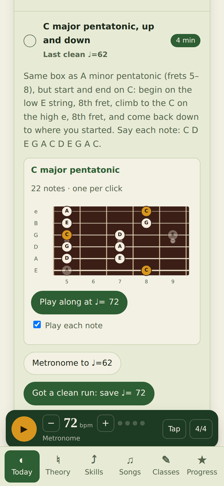
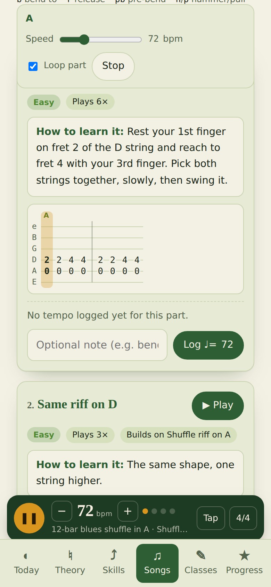
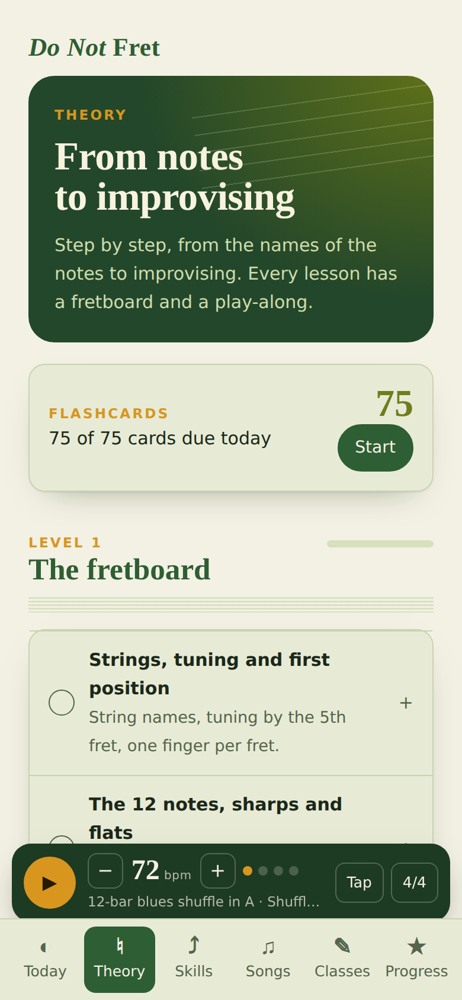
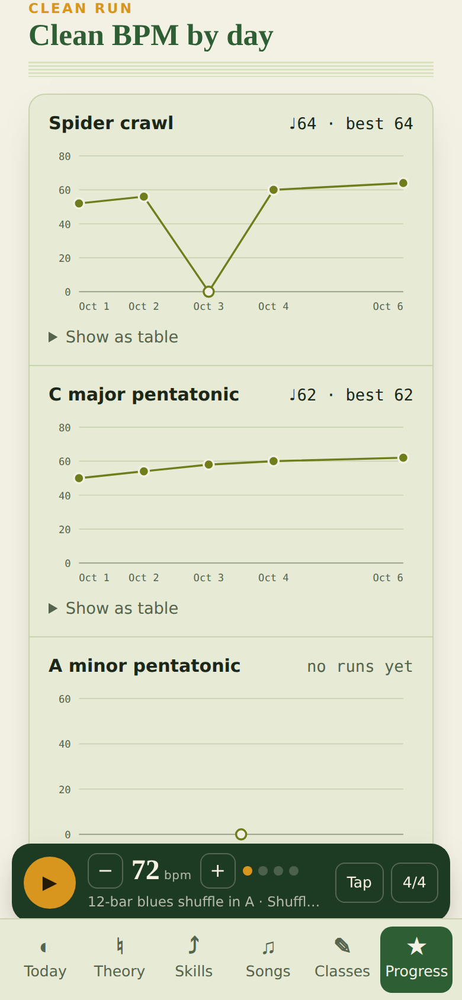

# Do Not Fret

**A free guitar practice app that runs in your browser.** It gives you a short daily routine with a metronome, play-along fretboards that light up the note you should be playing, theory lessons from "what are the notes?" up to improvising, songs with tab that scrolls with the beat, and a progress page that shows your clean tempo going up over time.

No account, no install, no ads. Your practice log stays on your device.

**▶ Open the app: https://nikki30.github.io/nikoftime/do-not-fret/**

<p>
  
  
  
  
</p>

---

## What's inside

| Page | What you do there |
|---|---|
| **Today** | Press **Start today's practice** for a 25-minute timer (with pause). Work through the routine: spider crawl, C major and A minor pentatonic, and a major/minor pentatonic pair that changes key every day. Each exercise has a fretboard that plays along with the metronome, note by note. When you play it **clean**, save the tempo. |
| **Theory** | 27 short lessons in 8 levels: the fretboard → intervals → rhythm → scales and keys → chords → movable shapes → pentatonics and blues → improvising. Every lesson has steps, a fretboard you can play along with, and flashcards. |
| **Skills** | 21 techniques (bends, vibrato, slides, palm muting, hybrid picking…) with how-to steps and a tab to practise. |
| **Songs** | Search and filter your songs. Each song is split into parts with a difficulty, a "learn this first" order and tips. Press **▶ Play** and the tab highlights each note on the beat; slow it down and loop it. Log a clean tempo per part. **Add your own songs** with the form at the bottom. |
| **Classes** | If you take lessons, set your class day and time to get a countdown, a class log, and your homework on the Today page. |
| **Progress** | Charts of your clean BPM by day, a practice **diary** (dates, notes and memorable moments), achievements, and your data backup. |

The metronome is docked at the bottom of every page: tap tempo, time signature, and an accented first beat.

### The one rule: what counts as a clean run

A tempo only counts if you played the whole exercise with **alternate picking** (down-up), **said every note out loud**, and made **no mistakes**. One clean run is enough to save it. If you practised but never got a clean run, tap **No clean run today**: the day still counts, and it shows as a 0 on the chart so you can see it.

---

## Using it

1. Open **https://nikki30.github.io/nikoftime/do-not-fret/** on your phone or computer.
2. On a phone, add it to your home screen so it opens like an app:
   - **iPhone (Safari):** Share → *Add to Home Screen*
   - **Android (Chrome):** ⋮ → *Add to Home screen*
3. Turn your volume up: the metronome clicks, and the exercises play each note as it lights up. Untick **Play each note** if you only want the click.

### Your data

Everything you log (tempos, practice minutes, diary, songs you add) is saved **in this browser on this device** (in `localStorage`). Nothing is sent anywhere. That also means:

- **Clearing your browser data deletes it.** Use **Progress → Your data → Export backup** now and then. It downloads one `.json` file.
- **To move to another phone or computer**, export there and **Import backup** here.
- Private/incognito windows forget everything when closed.

The only thing the page loads from the internet is its fonts (Google Fonts). Without a connection it still works, in your system fonts.

---

## Adding a song

On **Songs**, open **+ Add a song**. Give it a title, then add one or more **parts** (Intro, Verse, Solo…). Each part is either **Tab** (single notes and riffs) or **Chords** (a chord chart). Press **Save song**, and the play-along works right away.

### Tab notation

Notes are written `string:fret`. **String 6 is the thick low E** and string 1 is the thin high e. Separate notes with spaces.

| Write | Means |
|---|---|
| `5:3` | string 5 (A), fret 3 |
| `4:0` | open D string |
| `3:7b9` | bend fret 7 up to the pitch of fret 9 |
| `3:7b9r` | bend and release |
| `3:7pb9r` | pre-bend (bend before picking), then release |
| `4:0h2` / `4:2p0` | hammer-on / pull-off |
| `4:0h2p0` | both, quickly |
| `3:7/9` / `3:9\7` | slide up / slide down |
| `2:10~` | vibrato |
| `3:5c` | curl (a tiny bend) |
| `4:5m` | muted / palm-muted note |
| `3:<12>` | harmonic |
| `[3:7 2:8]` | notes played together (double stops, chord stabs) |
| `.` | a pause |
| `\|` | a bar line |
| `(4:3 5:3)x2` | repeat a group |
| `{Am}` | a chord strum |
| `"Verse"` | a label shown above the next note (lyric cue, strum pattern…) |

Example, a classic blues shuffle:

```
"A" [5:0 4:2] [5:0 4:2] [5:0 4:4] [5:0 4:4] | (5:0 4:2 5:0 4:4)x2
```

### Chord charts

Bars separated by `|`, each with an optional label in quotes:

```
"Verse" Am | F | C | G | "Chorus" F | G | Am | Am
```

The app comes with two example songs: a **12-bar blues shuffle in A** and the **Ode to Joy** melody. Open them to see the format in use, and delete your own songs from the top of the song page.

> Please only add tabs you have the right to use, or that you transcribed for your own practice. The app doesn't share them with anyone.

---

## Run it yourself or change it

The whole app is **one HTML file** with no build tools, frameworks or server.

**Run locally:** download [`index.html`](index.html) and double-click it. That's it.

**Host your own copy:** fork this repo and turn on GitHub Pages (*Settings → Pages → Source: GitHub Actions*; the workflow in `.github/workflows/pages.yml` publishes the repo). Your copy lives at `https://<you>.github.io/<repo>/do-not-fret/`.

**Change the starter content** (lessons, skills, the daily routine, example songs): edit `src/seed.json` and rebuild:

```bash
python3 do-not-fret/src/build.py
```

The starter content is only loaded the first time someone opens the app (or after **Reset everything**), so existing users keep their data.

### Project layout

```
do-not-fret/
├── index.html          ← the built app (what people open)
├── src/
│   ├── head.part       <title>, fonts, main styles
│   ├── extra.css       more styles
│   ├── body.part       page markup + all the JavaScript
│   ├── seed.json       starter lessons, skills, routine and example songs
│   └── build.py        joins the parts into index.html
└── docs/screenshots/
```

### Routine exercises in `seed.json`

Each entry under `drills` is one item on the Today page. The `ex` field sets what the fretboard plays:

| `ex` | Plays |
|---|---|
| `{"type": "spider", "last": 9}` | the 1-2-3-4 spider crawl from fret 1 up to position 9 and back |
| `{"root": "C", "scale": "majpent", "lo": 5, "hi": 8, "dir": "both", "rootToRoot": true}` | a scale box between frets `lo`–`hi`, low E to high e and back (`dir`: `up`, `down`, `both`); `rootToRoot` trims it to start and end on the root |
| `{"rotate": "major", "dir": "both"}` with `"rotateFrom": "A"` | a major pentatonic whose key changes every day (A, E, D, G, C, F, B♭…) |
| `{"rotate": "minor", "dir": "both"}` | the relative minor of that day's major key |

Scales: `major`, `minor`, `majpent`, `minpent`, `blues`, `chromatic`. Other fields: `name`, `how` (instructions), `minutes`, `order`, `startBpm`, `category` (`warmup`, `scale`, `skill`, `song`).

### How it works

- **Metronome and notes:** Web Audio. The click is scheduled ahead of time so it stays steady. Notes are synthesised with a [Karplus-Strong](https://en.wikipedia.org/wiki/Karplus%E2%80%93Strong_string_synthesis) plucked string, so there are no audio files.
- **Fretboards and charts:** plain SVG drawn from the scale formulas, so any key works.
- **Storage:** a tiny document store on top of `localStorage`. (The same code also runs as a private app inside Claude, where it syncs to a database instead.)
- Light and dark mode follow your device.

---

Made by [Nikita](https://github.com/nikki30) while learning guitar, starting from the pages of a practice notebook.
